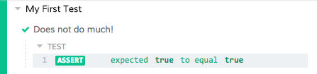

# Cypress

Cypress to narzędzie do testowania front-end nowej generacji stworzone dla nowoczesnej sieci. 

## Instalacja Cypress - Wymagania styemowe

### **System operacyjny:** 

Cypress to aplikacja komputerowa, która jest instalowana na komputerze. Aplikacja komputerowa obsługuje następujące systemy operacyjne:
* macOS 10.9+ (64-bit)
* Linux Ubuntu 12.04+, Fedora 21 i Debian 8 (64-bit)
* Windows 7+

### **Node.js**

Jeżeli używamy npm, żeby zainstalować Cypress to wspierana jest wersja:
* Node.js 10/12+

### **Linux**

Jeżeli używamy systemów linuks to musimy zainstalować zależności.

Ubuntu/Debian
```
apt-get install libgtk2.0-0 libgtk-3-0 libgbm-dev libnotify-dev libgconf-2-4 libnss3 libxss1 libasound2 libxtst6 xauth xvfb
```
### **CentOS**
```
yum install -y xorg-x11-server-Xvfb gtk2-devel gtk3-devel libnotify-devel GConf2 nss libXScrnSaver alsa-lib
```
## Proces installacji

### npm

```
cd /your/project/path
```
```
npm install cypress --save-dev
```

## Otworzenie Cypress

Jeżeli używamy npm do instalacji to po zainstalowaniu znajdziemy Cypress w ./node_modules

Pełna ścieżka:
```
./node_modules/.bin/cypress open
```

## Przeglądarki

Cypress Test Runner próbuje znaleźć wszystkie zgodne przeglądarki na komputerze użytkownika. 

## Dodanie pliku testowego

* Tworzymy plik testowy np. sample_spec.js
*  Cypress zaktualizuje naszą listę specyfikacji
* Otwieramy Cypress Test Runner

Następnie tworzymy nowy plik w lokalizacji "cypress/integration", która została dla nas utworzona:
```
touch {your_project}/cypress/integration/sample_spec.js
```
Po utworzeniu tego pliku powinniśmy zobaczyć, że Cypress Test Runner natychmiast wyświetli go na liście testów integracji. Cypress monitoruje pliki specyfikacji pod kątem wszelkich zmian i automatycznie wyświetla wszelkie zmiany.

## Napisz pierwszy test

Mamy zamiar:

* Napisać test zakończony sukcesem
* Napisać test zakończony niepowodzeniem
* Obserwować działanie w tle

W miarę zapisywania naszego nowego pliku testowego zobaczymy, że przeglądarka automatycznie ładuje się ponownie w czasie rzeczywistym.

Otwórz swoje ulubione IDE i dodaj poniższy kod do naszego pliku testowego sample_spec.js.

```
describe('My First Test', () => {
  it('Does not do much!', () => {
    expect(true).to.equal(true)
  })
})
```


Po zapisaniu tego pliku powinieneś zobaczyć ponowne załadowanie przeglądarki.



Następnie napiszmy nasz test, który powinnien zakończyć się niepowodzeniem.

```
describe('My First Test', () => {
  it('Does not do much!', () => {
    expect(true).to.equal(false)
  })
})
```


Po ponownym zapisaniu zobaczysz, że Cypress wyświetla negatywny test na czerwono.


W ten sposób zainstalowaliśmy Cypress i wykonaliśmy dwa przykładowe testy.